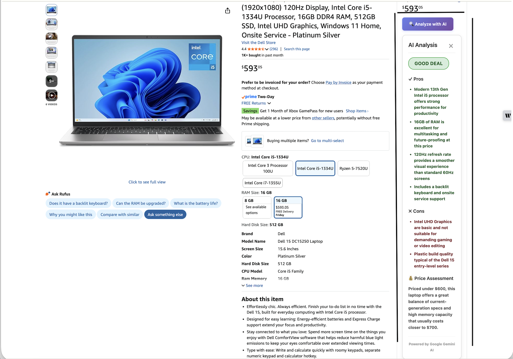

# Amazon Smart Analyzer

An intelligent Chrome extension that provides AI-powered analysis of Amazon products to help you make smarter purchasing decisions. Get instant insights on product value, pricing comparisons, and honest pros/cons before you buy.

## Features

- **AI-Powered Analysis**: Uses Google Gemini 1.5 Flash to analyze products based on reviews, specifications, and ratings
- **Smart Verdict**: Get an instant recommendation - Good Deal, Fair, or Overpriced
- **Comprehensive Insights**:
  - Detailed pros and cons
  - Price assessment with market intelligence
  - Summary of key considerations
- **Secure & Private**: Your API key is stored locally in your browser
- **Non-Intrusive UI**: Clean button that appears only on product pages
- **Fast Analysis**: Results in 10-20 seconds
- **100% Free**: Uses free Google Gemini API (no subscription needed)

## Installation

### Step 1: Get a Free Gemini API Key

1. Visit [Google AI Studio](https://aistudio.google.com/app/apikey)
2. Sign in with your Google account
3. Click "Create API Key"
4. Copy the generated API key (starts with `AIza...`)

### Step 2: Install the Extension

1. Download or clone this repository:
   ```bash
   git clone <repository-url>
   cd amazon-smart-analyzer
   ```

2. Open Chrome and navigate to `chrome://extensions`

3. Enable **Developer mode** (toggle in top-right corner)

4. Click **Load unpacked**

5. Select the `amazon-smart-analyzer` folder

6. The extension should now appear in your extensions list

### Step 3: Configure API Key

1. Click the extension icon in your Chrome toolbar
2. Paste your Gemini API key into the input field
3. Click "Save API Key"
4. You're ready to go!

## Usage

**[📺 Watch Demo Video](https://www.youtube.com/watch?v=pYl1JyWr7dc)** - See the extension in action!

1. Navigate to any Amazon product page (e.g., amazon.com, amazon.co.uk, amazon.in)
2. Look for the **"🔍 Analyze with AI"** button near the product price
3. Click the button to start analysis
4. Wait 10-20 seconds for AI analysis
5. Review the results:
   - **Verdict Badge**: Color-coded recommendation (Green/Yellow/Red)
   - **Pros**: What's good about this product
   - **Cons**: What to watch out for
   - **Price Assessment**: Whether the price is reasonable

### Example



The screenshot above shows the extension analyzing a Dell 15 laptop on Amazon, providing a "Good Deal" verdict with detailed pros, cons, and price assessment.

## Supported Amazon Domains

- amazon.com (US)
- amazon.co.uk (UK)
- amazon.in (India)
- amazon.de (Germany)
- amazon.ca (Canada)
- amazon.fr (France)
- amazon.es (Spain)
- amazon.it (Italy)
- amazon.co.jp (Japan)

## Privacy & Security

- **No Data Collection**: We don't collect, store, or transmit any of your browsing data
- **Local Storage**: Your API key is stored locally in Chrome's secure storage
- **No Tracking**: No analytics, no telemetry, no user tracking
- **Open Source**: All code is visible for inspection

## API Usage & Limits

The extension uses Google Gemini's free tier:
- **15 requests per minute**
- **1,500 requests per day**

This is more than enough for typical personal use (analyzing products while shopping).

## Troubleshooting

### Button doesn't appear
- Make sure you're on an actual product page (not search results or cart)
- Try refreshing the page
- Check that the extension is enabled in `chrome://extensions`

### "Invalid API key" error
- Verify your API key starts with `AIza`
- Get a new key from [Google AI Studio](https://aistudio.google.com/app/apikey)
- Make sure you saved the key in extension settings

### "Too many requests" error
- You've hit the rate limit (15 requests/minute)
- Wait a minute and try again
- Consider analyzing fewer products in quick succession

### Analysis fails or times out
- Check your internet connection
- Try refreshing the page and analyzing again
- Some products may have insufficient data for analysis

## Development

### Project Structure

```
amazon-smart-analyzer/
├── manifest.json       # Extension configuration
├── content.js          # Main content script
├── popup.html          # Settings UI
├── popup.js            # Settings logic
├── styles.css          # Styling
├── icons/              # Extension icons
└── README.md           # This file
```

### Local Development

1. Make changes to the code
2. Go to `chrome://extensions`
3. Click the refresh icon on the extension card
4. Test changes on Amazon product pages

### Building

No build step required! This is a pure vanilla JavaScript extension.

## Contributing

Contributions welcome! Please:
1. Fork the repository
2. Create a feature branch
3. Make your changes
4. Test thoroughly on multiple Amazon domains
5. Submit a pull request

## License

MIT License - feel free to use, modify, and distribute.

## Disclaimer

This extension is not affiliated with or endorsed by Amazon or Google. It's an independent tool built to help consumers make informed purchasing decisions.

The AI analysis is provided as-is and should be considered as one data point in your decision-making process. Always do your own research before making purchases.

## Support

Having issues? Please [open an issue](https://github.com/your-repo/issues) with:
- Chrome version
- Extension version
- Steps to reproduce the problem
- Console error messages (if any)

---

Made with ❤️ to help you shop smarter
